# 🚀 Tier-0 Identity Security Lab

### Simulating Real-World Identity Attacks in a Hybrid Environment

---

## 🔍 Overview

This project demonstrates how identity compromise impacts a modern hybrid environment using Active Directory and cloud identity.

Instead of focusing on theory, this lab simulates real-world identity attack scenarios and analyzes how different identity types affect control, access, and detection.

> Identity is not just part of the security stack — it is the control plane.

---

## 🏗️ Architecture

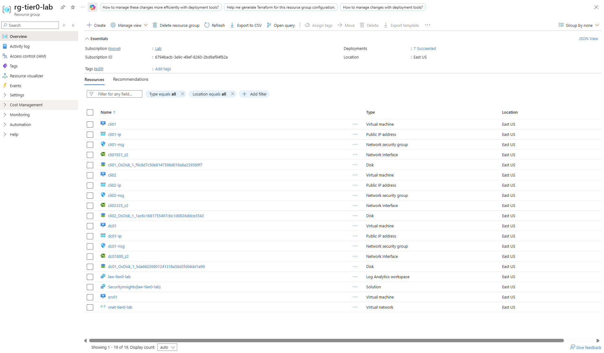

*All lab resources are deployed within a single isolated Azure resource group to ensure clean segmentation and repeatability.*

---

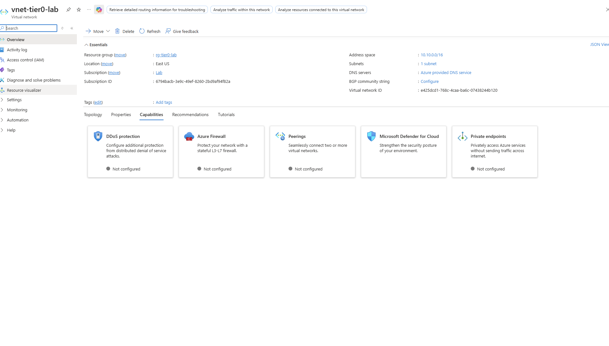

*The virtual network defines the internal communication layer between the domain controller, sync server, and endpoints.*

---

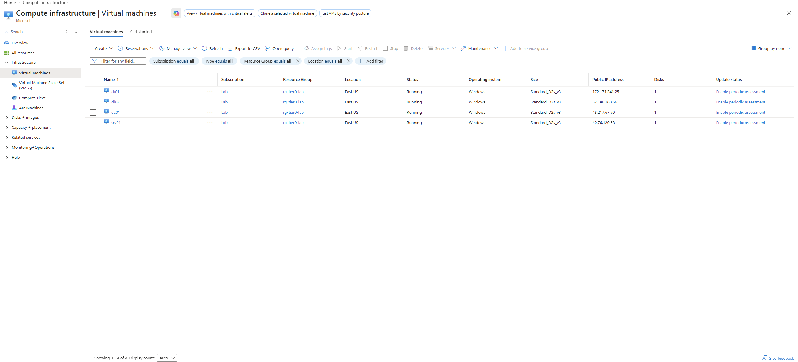

*Core lab infrastructure including domain controller, hybrid sync server, and client endpoints.*

---

### Architecture Summary

* On-premises domain: `corp.local`
* Cloud identity: Microsoft Entra ID
* Hybrid sync via Entra Connect
* Monitoring via Microsoft Sentinel
* All resources deployed in Azure within a single VNet

---

## 🖥️ Active Directory (On-Prem)

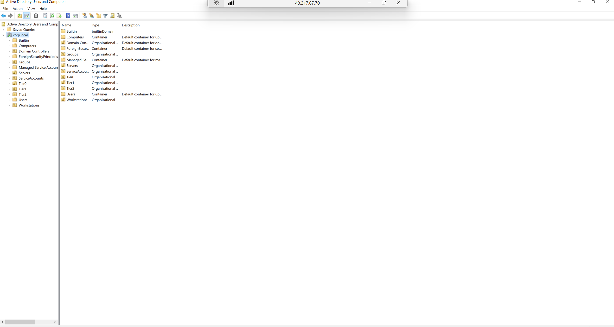

*Organizational Units structured using a tiered model (Tier-0, Tier-1, Tier-2) to simulate enterprise identity segmentation.*

---

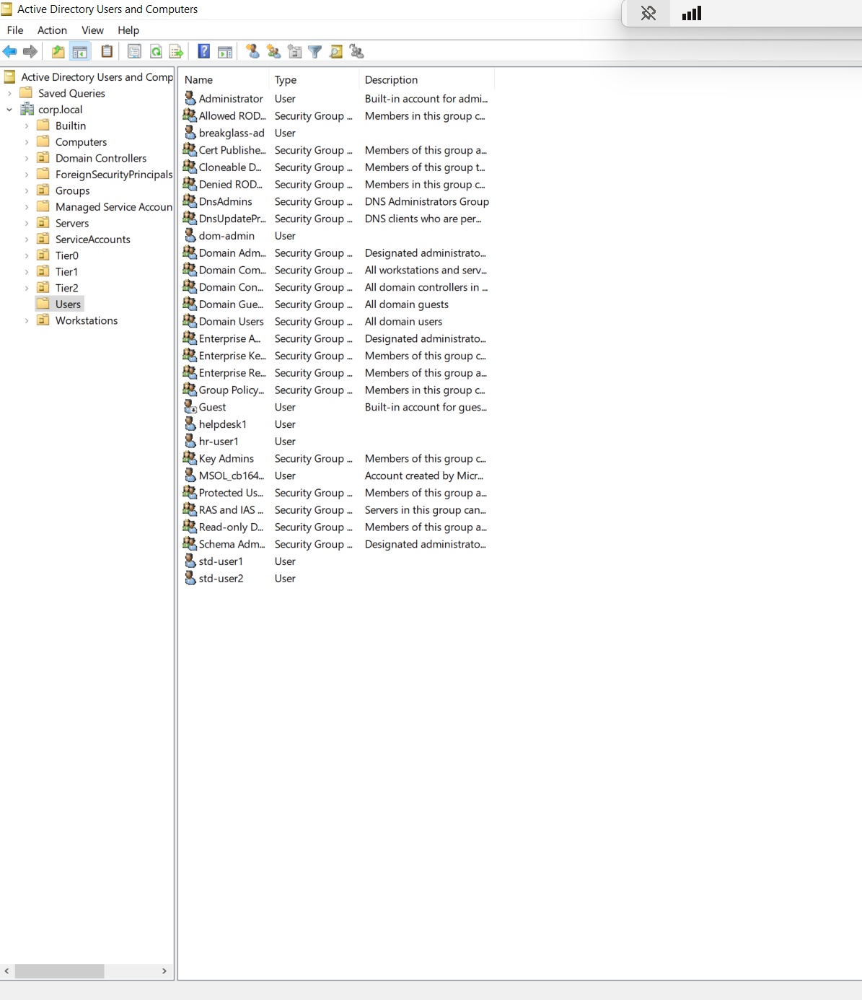

*Standard users, service accounts, and administrative identities used for attack simulation.*

---

## ☁️ Microsoft Entra ID

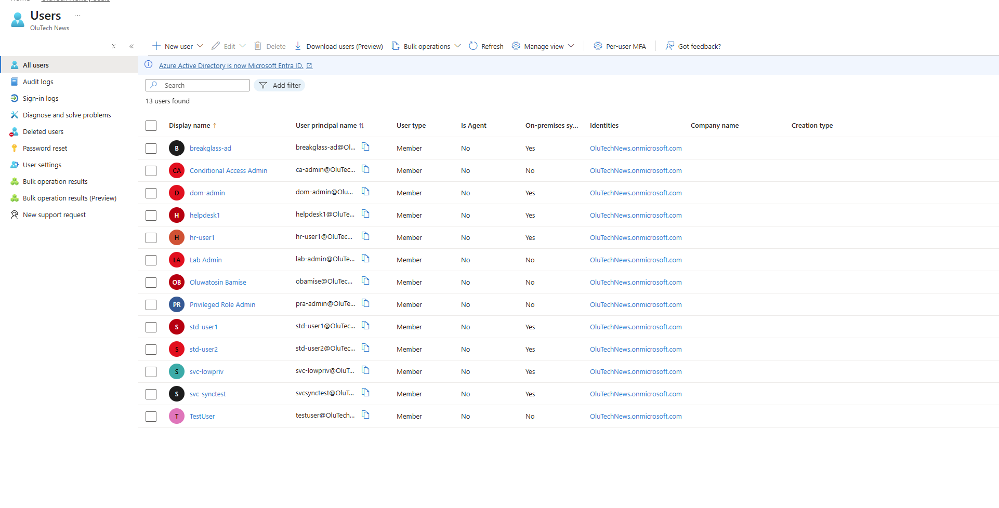

*Hybrid identity synchronization showing on-prem users available in the cloud.*

---

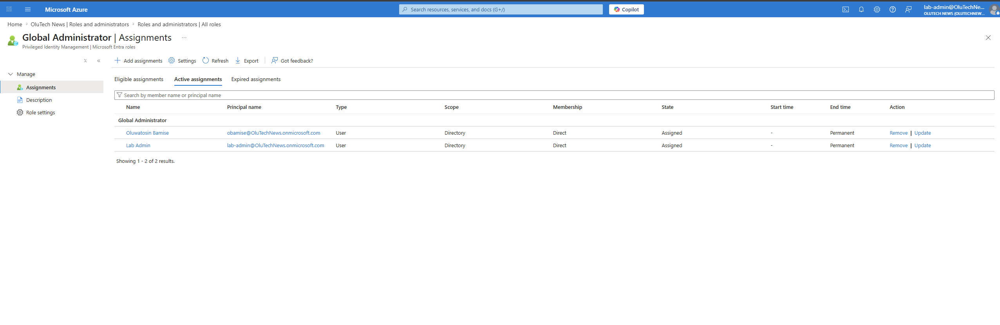

*Privileged roles centrally managed in Entra ID, forming the control plane of the environment.*

---

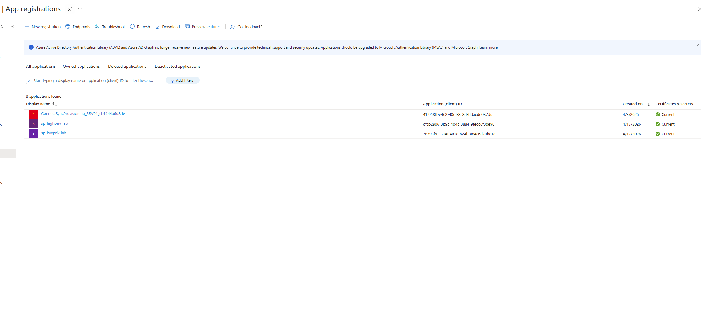

*Workload identities (service principals) created to simulate machine identity risk.*

---

## 🔐 Security Controls Implemented

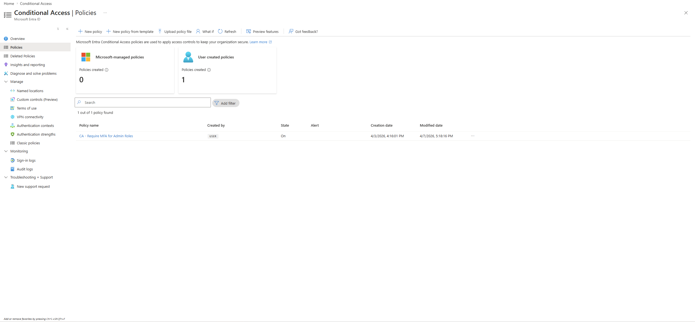

*Conditional Access enforcing MFA for privileged roles.*

---

*Privileged Identity Management enforcing just-in-time administrative access.*

---

### Controls Configured

* Conditional Access (MFA for admin roles)
* Privileged Identity Management (PIM)
* Break-glass account exclusion
* Centralized logging with Sentinel

---

## 🔄 Hybrid Identity

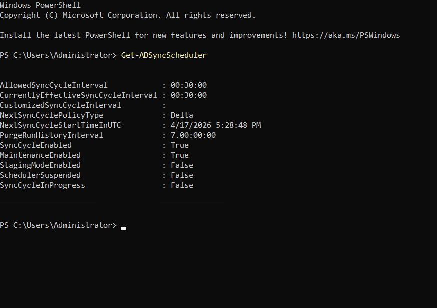

*On-prem identities synchronized to cloud via Entra Connect, enabling hybrid authentication.*

---

## 📊 Monitoring & Detection

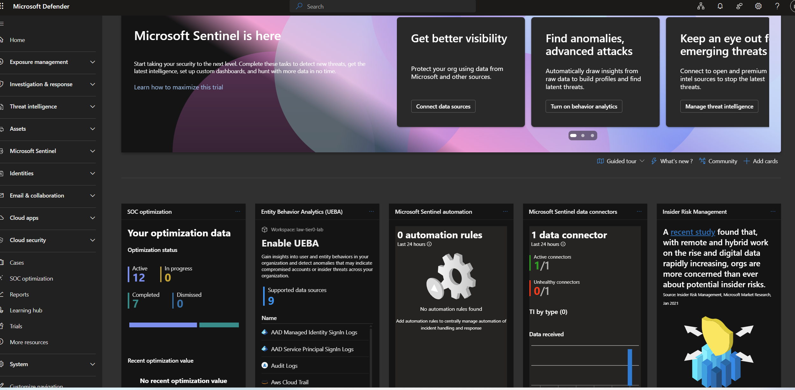

*Microsoft Sentinel used for centralized monitoring and investigation.*

---

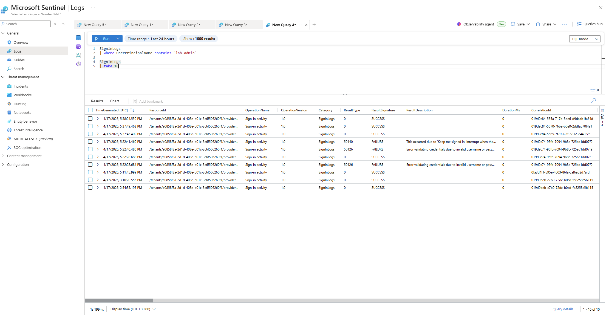

*User authentication activity captured for visibility and analysis.*

---

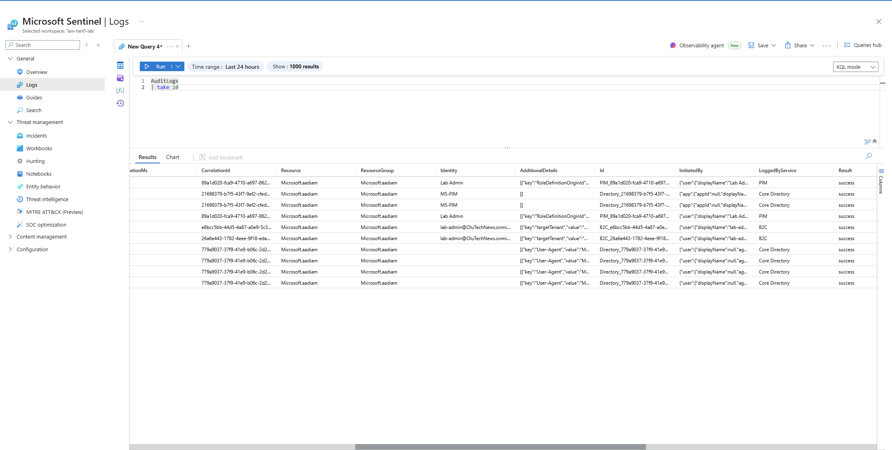

*Administrative actions such as role assignments and policy changes.*

---

## ⚔️ Attack Scenarios Simulated

---

### 🔹 Scenario 1: Standard User Compromise

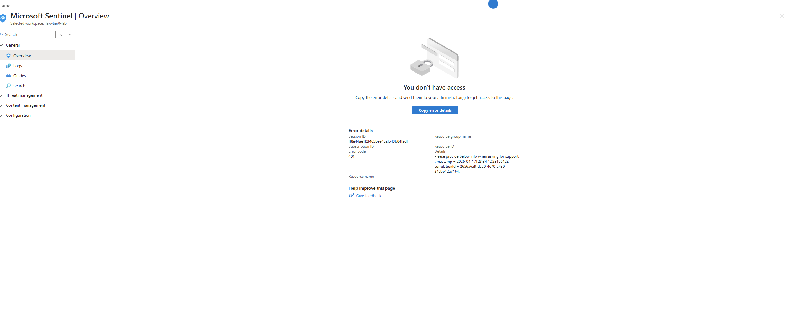

*Standard users are restricted from administrative actions, demonstrating low blast radius.*

**Findings:**

* No privilege escalation
* Limited system visibility
* Minimal impact

---

### 🔹 Scenario 2: Tier-0 Identity Compromise

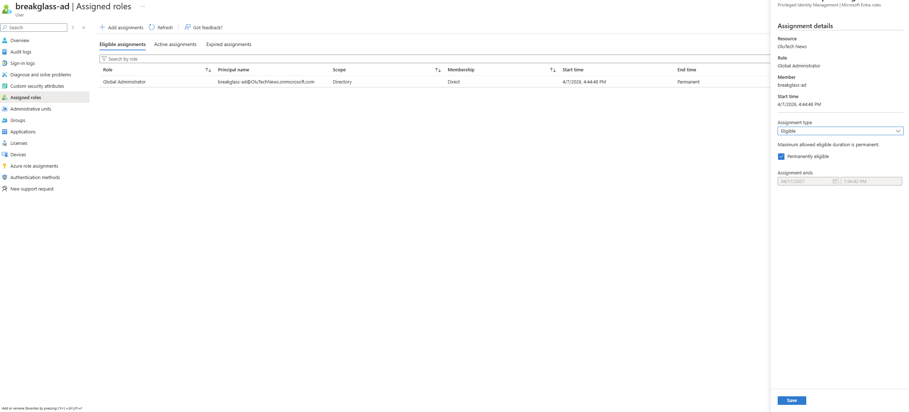

*Privileged account assigning Global Administrator role to another user.*

---

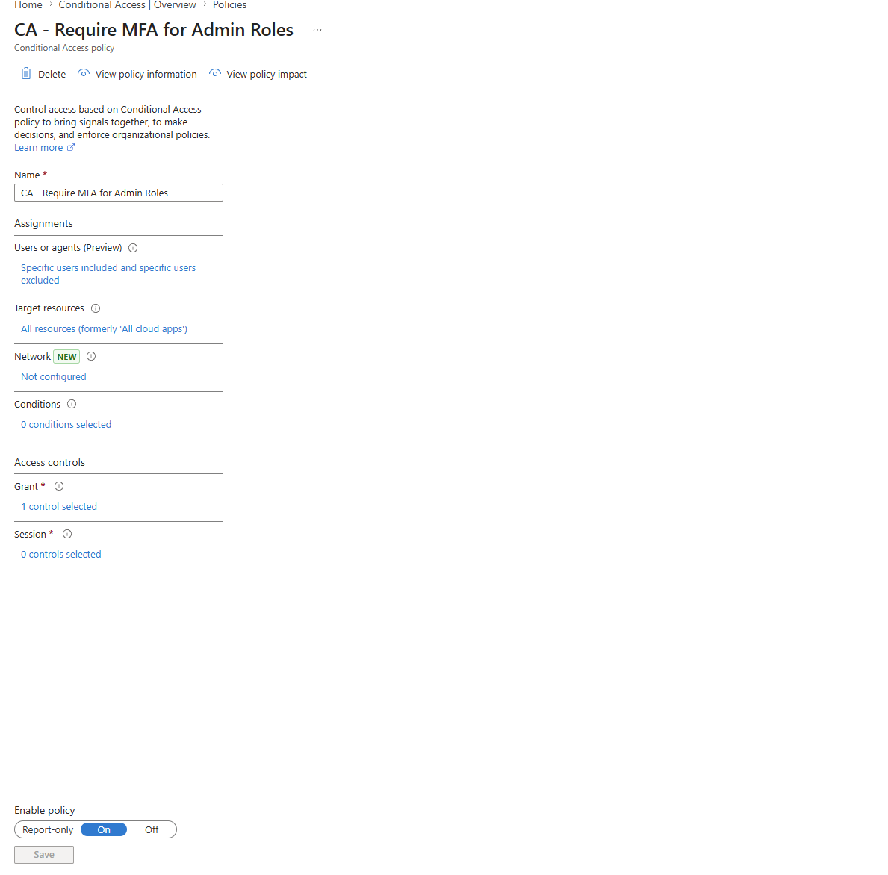

*Security policies can be modified when Tier-0 access is compromised.*

---

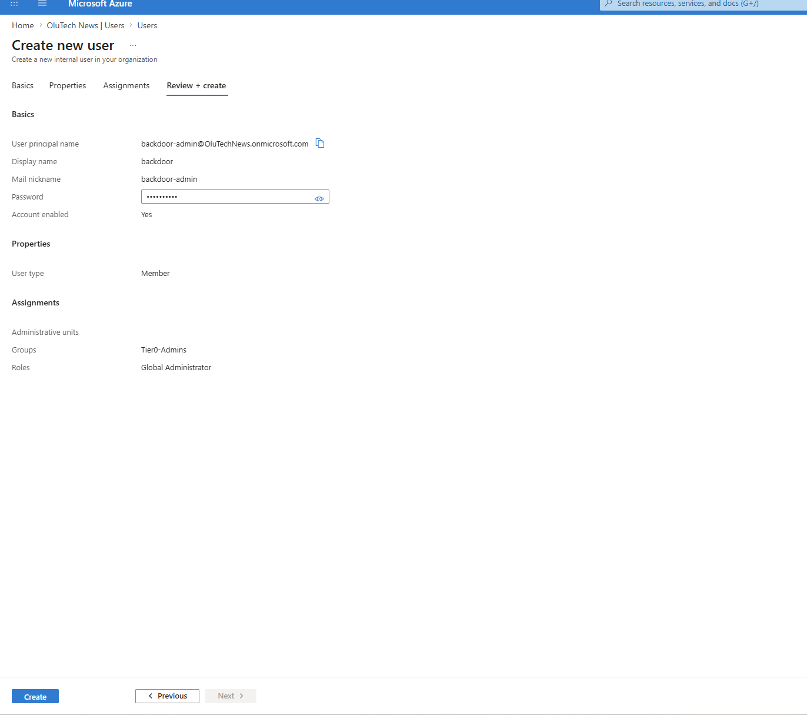

*New privileged accounts can be created to maintain persistence.*

---

**Findings:**

* Full environment control achieved rapidly
* Security posture can be altered
* High blast radius across tenant

---

### 🔹 Scenario 3: Session Persistence

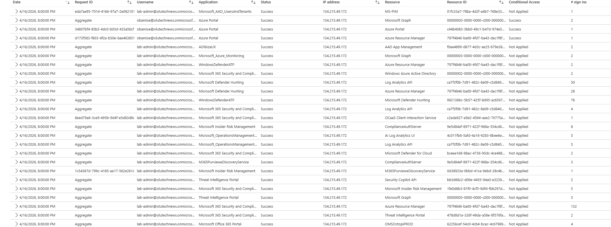

*Administrative actions continue without repeated authentication after initial login.*

**Findings:**

* MFA required only at login
* Session reuse reduces friction
* Increased risk post-authentication

---

### 🔹 Scenario 4: Workload Identity Risk

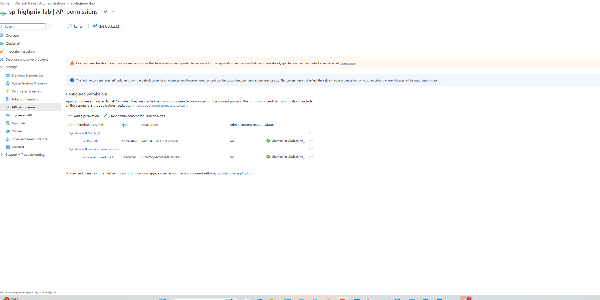

*Over-permissioned service principals demonstrate hidden attack surface risk.*

**Findings:**

* Low-privilege identities have minimal impact
* High-privilege identities can access broad directory data
* Machine identities are often under-monitored

---

## 📊 Key Takeaways

* Identity is the control plane of modern environments
* Tier-0 accounts can rapidly lead to full system control
* MFA alone is not sufficient without session-level protection
* Workload identities must be governed like user identities
* Detection relies heavily on identity-based telemetry

---

## 🛠️ Tools & Technologies

* Microsoft Entra ID
* Microsoft Sentinel
* Active Directory Domain Services
* Azure Virtual Machines
* Azure Networking

---

## 🔁 Identity Attack Flow

User Compromise → Privilege Escalation → Policy Modification → Persistence → Full Control

* Standard users are blocked early
* Tier-0 identities bypass most controls
* Sessions reduce authentication friction
* Workload identities introduce hidden risk

---

## 📌 Future Improvements

* Add automated attack simulation scripts
* Expand Sentinel detection queries (KQL)
* Include video walkthrough of lab
* Extend workload identity scenarios

---

## 💡 Final Thoughts

This project demonstrates how identity compromise behaves in a real hybrid environment.

Understanding identity behavior under attack conditions is critical for designing effective security controls.

---
